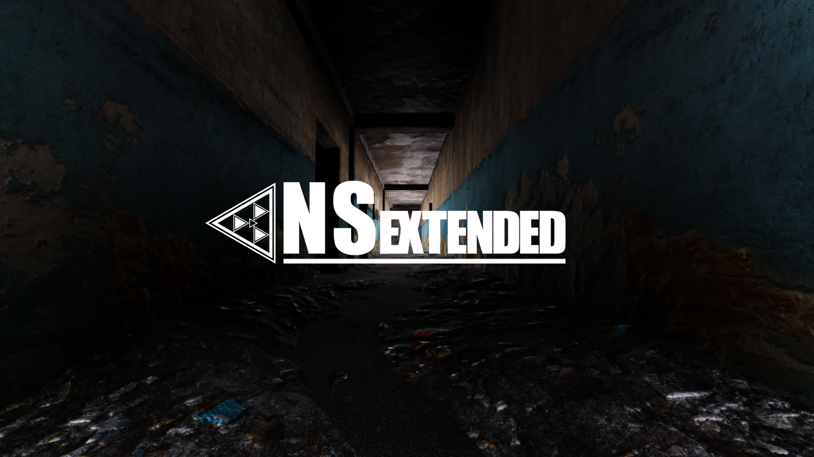

 

# NEAREST-STAGE: ENGINE
NEAREST-STAGE: ENGINE - движок изначально основанный на наработках X-RAY OMP, но притерпел огромнейшие изменения в графическом, техническом и геймплейном плане.

## ИТОГ
За несколько лет работы над проектом было проделано многое, настолько что перечислить все это я не смогу, я отказался от предложения "Продажи" так-как считаю, что это банальное обесценивание моего потраченного времени и сил, а так как заниматься данным проектом более желания нет, я наконец-то принял решение сделать его Open-Source, поэтому открываю все его ресурсы.
Точнее - Исходный код движка, Исходный код лаунчера (который так и не был доделан), Репозиторий с большей частью геймдаты игры.
За дополнительными данными и ресурсами проекта можете обратиться в мой VK(для тех кто знает) или же мне в discord: alistairfox.

Текстуры к игре: https://drive.google.com/file/d/1UBmQ_jjxpeuGlJECu0pPm1t2PcCaGbLb/view?usp=sharing
